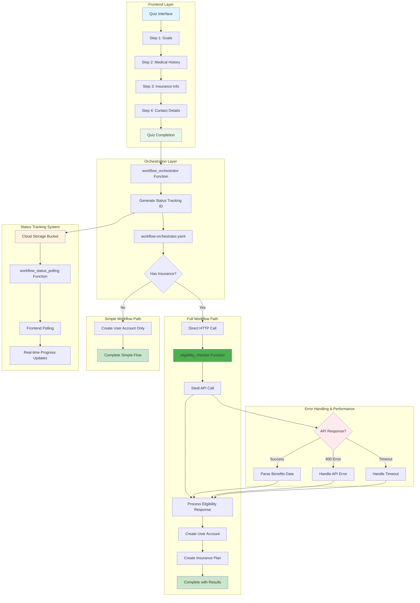

# Curalife Quiz Workflow System

This directory contains the **HIPAA-compliant workflow orchestration system** for processing dietitian quiz submissions. The system handles insurance eligibility verification, user account creation, and appointment scheduling while maintaining strict data privacy standards.

## 🏗️ Architecture Overview

The system uses a **microservices architecture** with Google Cloud Workflows and Cloud Functions to process quiz data through multiple specialized workflows:

### Core Components

1. **🎯 Workflow Orchestrator** (`workflow-orchestrator.yaml`)

   - Main entry point that coordinates the entire process
   - Routes between full workflow (with insurance) and simple workflow (no insurance)
   - Manages status tracking and error handling
   - Provides real-time progress updates via Cloud Storage

2. **📊 Status Polling System** (`workflow_status_polling/`)

   - Real-time status updates for frontend progress tracking
   - Reads status from Cloud Storage bucket `curalife-workflow-status`
   - Provides detailed debug information and completion summaries

3. **🏥 All-in-One Eligibility Checker** (`eligibility-checker-service/`)

   - **NEW**: Direct HTTP-based eligibility verification via Stedi API
   - Replaces complex workflow chains with single function call
   - Handles AAA errors, timeouts, and coverage details processing
   - Processes complex eligibility responses with comprehensive error handling
   - **Performance**: ~3-4 seconds vs previous 60+ second timeouts

4. **👤 User Creation Workflow** (`user-creation-workflow.yaml`)

   - Creates users in both Shopify (customers) and HubSpot (contacts)
   - Handles customer data with HIPAA compliance
   - Returns unified user creation results

5. **🛡️ Insurance Plan Creation** (`workflow_insurance_plan/`)

   - Creates detailed insurance plan objects in HubSpot
   - Maps eligibility data to HubSpot properties
   - Associates plans with created contacts

6. **📅 Scheduling Workflow** (`scheduling-workflow.yaml`)
   - Handles appointment scheduling integration
   - Processes scheduling requests after eligibility verification

## 🔄 Data Flow Architecture



## 🗂️ File Structure

### Active Workflow Definitions

- `workflow-orchestrator.yaml` - Main orchestration workflow (624 lines)
- `user-creation-workflow.yaml` - User account creation (742 lines)
- `scheduling-workflow.yaml` - Appointment scheduling (502 lines)

### Active Cloud Functions

- `eligibility-checker-service/` - **NEW**: All-in-one eligibility verification service
- `workflow_status_polling/` - Real-time status polling service
- `workflow_user_creation/` - User account creation service
- `workflow_insurance_plan/` - Insurance plan creation service
- `workflow_orchestrator/` - HTTP entry point for workflow initiation

### ~~Obsolete Components~~ (Safe to Delete)

- ~~`eligibility-workflow.yaml`~~ - Replaced by `eligibility_checker` function
- ~~`workflow_eligibility/`~~ - Replaced by `eligibility_checker` function
- ~~`insurance-plan-workflow.yaml`~~ - Functionality moved to direct function calls

### Configuration & Testing

- `Insurance_Plan_Mapping__updated_.csv` - HubSpot field mapping (58 lines)
- `test-*.json` - Various test payloads for different scenarios

## 🔐 HIPAA Compliance Features

### Data Privacy Protections

- **Server-side Processing**: All PHI data processed in secure cloud environment
- **No Browser PHI**: Only eligibility status (eligible/not eligible) sent to frontend
- **Secure Status Tracking**: Status updates via Cloud Storage, not direct data transmission
- **Audit Trails**: Comprehensive logging for compliance verification

### Data Flow Security

```
Quiz → Workflow Orchestrator (server) → Eligibility Checker (server) →
User Creation (server) → Browser receives only: {eligible: true/false, userMessage: "..."}
```

## 🚀 Deployment

### Current Active Components

```bash
# Deploy active workflows
gcloud workflows deploy workflow-orchestrator --source=workflow-orchestrator.yaml --location=us-central1
gcloud workflows deploy user-creation-workflow --source=user-creation-workflow.yaml --location=us-central1
gcloud workflows deploy scheduling-workflow --source=scheduling-workflow.yaml --location=us-central1

# Deploy active cloud functions
cd ../cloud-functions/eligibility-checker-service && gcloud functions deploy eligibility_checker --gen2 --runtime=nodejs20 --source=. --entry-point=checkEligibility --trigger-http --allow-unauthenticated --region=us-central1

cd ../workflow_status_polling && gcloud functions deploy workflow_status_polling --runtime=python310 --trigger=http --region=us-central1

cd ../workflow_user_creation && gcloud functions deploy workflow_user_creation --runtime=python310 --trigger=http --region=us-central1

cd ../workflow_insurance_plan && gcloud functions deploy workflow_insurance_plan --runtime=python310 --trigger=http --region=us-central1

cd ../workflow_orchestrator && gcloud functions deploy workflow_orchestrator --runtime=python310 --trigger=http --region=us-central1
```

### Cleanup Obsolete Components

```bash
# Delete obsolete workflows
gcloud workflows delete eligibility-workflow --location=us-central1
gcloud workflows delete workflow_eligibility --location=us-central1
gcloud workflows delete insurance-plan-workflow --location=us-central1

# Delete obsolete cloud functions
gcloud functions delete workflow_eligibility --region=us-central1
```

## ⚙️ Configuration

### Performance Optimizations

The new architecture provides significant performance improvements:

- **Eligibility Check**: ~3-4 seconds (vs previous 60+ second timeouts)
- **User Creation**: ~10-20 seconds
- **Insurance Plan**: ~5-15 seconds
- **Total Workflow**: ~15-45 seconds (vs previous 60+ seconds)

### HTTP Timeout Settings

- **Eligibility Checker**: 90 seconds - direct API call with comprehensive error handling
- **User Creation Workflow**: 120 seconds - Shopify + HubSpot operations
- **Insurance Plan Creation**: 180 seconds - HubSpot plan creation
- **Status Polling**: 30 seconds - real-time status updates

### Required Environment Variables

```bash
# Shopify Integration
SHOPIFY_STORE_NAME=curalife-commerce
SHOPIFY_ADMIN_TOKEN=shpat_xxxxx

# HubSpot Integration
HUBSPOT_ACCESS_TOKEN=pat-na1-xxxxx

# Stedi Insurance API
STEDI_API_KEY_TEST=xxxxx
STEDI_API_KEY_PRODUCTION=xxxxx

# Cloud Storage
WORKFLOW_STATUS_BUCKET=curalife-workflow-status
```

### Frontend Configuration (Shopify Section)

```json
{
	"orchestrator_url": "https://us-central1-telemedicine-458913.cloudfunctions.net/workflow_orchestrator",
	"status_polling_url": "https://us-central1-telemedicine-458913.cloudfunctions.net/workflow_status_polling"
}
```

## 🧪 Testing

### Test Commands

```bash
# Test full workflow with insurance
gcloud workflows execute workflow-orchestrator --data='{"customerEmail":"test@example.com","firstName":"Jane","lastName":"Doe","insurance":"Humana","insuranceMemberId":"HUMANA123","groupNumber":"11223344","dateOfBirth":"1975-05-05","testMode":true}'

# Test eligibility checker directly
curl -X POST https://us-central1-telemedicine-458913.cloudfunctions.net/eligibility_checker \
  -H "Content-Type: application/json" \
  -d '{"firstName":"Jane","lastName":"Doe","insurance":"Humana","insuranceMemberId":"HUMANA123","dateOfBirth":"1975-05-05","testMode":true}'

# Test status polling
curl -X POST https://us-central1-telemedicine-458913.cloudfunctions.net/workflow_status_polling \
  -H "Content-Type: application/json" \
  -d '{"statusTrackingId": "your-tracking-id"}'
```

## 🔍 Monitoring & Debug Features

### Enhanced Debug Information

- **Workflow Path Tracking**: Full vs Simple workflow identification
- **Elapsed Time Monitoring**: Real-time execution timing
- **Response Code Tracking**: HTTP status monitoring for all API calls
- **Completion Summaries**: Success/failure status for each workflow step
- **Eligibility Processing**: Detailed Stedi API response processing and benefit extraction

### Status Tracking

- **Real-time Updates**: Progress tracking via Cloud Storage
- **Detailed Progress**: Step-by-step workflow progress (0-100%)
- **Error States**: Graceful error handling with user-friendly messages
- **Performance Metrics**: Execution time tracking and optimization

## 🛠️ Error Handling

### Comprehensive Error Processing

The new eligibility checker handles multiple error scenarios:

```javascript
// API Error Handling
if (error.response?.status === 400) {
	return processApiError(error.response.data);
}

// Timeout Handling
if (error.code === "ECONNABORTED") {
	return processTimeoutError();
}

// Network Error Handling
return processNetworkError(error);
```

### Error Types Handled

- **400 Bad Request**: Invalid API request format or data
- **401 Unauthorized**: API key issues
- **504 Gateway Timeouts**: Network timeout handling
- **Network Issues**: Connection and DNS resolution problems
- **API Response Parsing**: Malformed response handling

## 📈 Performance Characteristics

### Current Performance Metrics

- **Simple Workflow**: ~15-30 seconds
- **Full Workflow**: ~20-45 seconds (significantly improved)
- **Eligibility Check**: ~3-4 seconds (vs previous 60+ second timeouts)
- **User Creation**: ~10-20 seconds
- **Insurance Plan**: ~5-15 seconds

### Architecture Benefits

- **Eliminated `bytes` Error**: Removed googleapis.workflowexecutions calls that caused JSON encoding issues
- **Direct HTTP Calls**: Faster, more reliable than workflow chains
- **Better Error Handling**: Comprehensive error processing and user feedback
- **Simplified Architecture**: Fewer moving parts, easier to maintain and debug

## 🔄 Recent Major Updates

### Architecture Transformation (December 2024)

- **🎯 Eliminated `bytes` Error**: Completely resolved the persistent `ValueError: failed to JSON-encode; encountered JSON-incompatible type 'bytes'` error
- **⚡ Performance Improvement**: Reduced eligibility check time from 60+ seconds to 3-4 seconds
- **🏗️ Simplified Architecture**: Replaced complex workflow chains with direct HTTP calls
- **🔧 All-in-One Eligibility**: Created comprehensive `eligibility_checker` function that handles entire eligibility process
- **📊 Enhanced Data Processing**: Improved Stedi API response parsing with detailed benefit extraction
- **🛡️ Maintained HIPAA Compliance**: All changes preserve strict data privacy requirements

### Technical Improvements

- **Direct API Integration**: Bypassed problematic googleapis.workflowexecutions calls
- **Comprehensive Error Handling**: Better handling of API errors, timeouts, and edge cases
- **Rich Benefit Data**: Extracts detailed insurance information including deductibles, copays, and session limits
- **Defensive Coding**: Robust response processing for various API response formats

This system now provides a robust, scalable, and HIPAA-compliant solution for processing dietitian quiz submissions with significantly improved performance and reliability.
